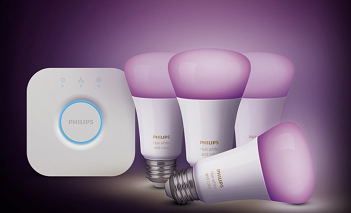

# Philips Hue Binding

This binding integrates the [Philips Hue Lighting system](https://www.meethue.com).
The integration happens through the Hue Bridge, which acts as an IP gateway to the ZigBee devices.

 

## Supported Things

The Hue Bridge is required as a "bridge" for accessing any other Hue device.
It supports the ZigBee LightLink protocol as well as the upwards compatible ZigBee 3.0 protocol.
There are two types of Hue Bridges, generally referred to as v1 (the rounded version) and v2 (the squared version).
The difference between the two generation of bridges is that the v2 bridge added support for Apple HomeKit in v2, and for CLIP v2 / API v2 (see next paragraph).
Both bridges are fully supported by this binding.

Both types of bridges are accessed by means of the "CLIP" ('Connected Lighting Interface Protocol') Application Program Interface ('API').
There are two versions of CLIP - namely CLIP v2 and CLIP v1, which are referrered to as API v2 and API v1 in the rest of this document.
Philips has stated that any new features (such as dynamic scenes) will only be available on API v2, and in the long term API v1 will eventually be removed.
Older v1 (round) bridges will not support API v2.
The API v2 has more features e.g. it supports Server Sent Events 'SSE' which means that it is much faster to receive status updates in openHAB.
For this reason it is recommended to use API v2 for new openHAB installations.

Almost all available Hue devices are supported by this binding.
This includes not only the "Friends of Hue", but also products like the LivingWhites adapter.
Additionally, it is possible to use OSRAM Lightify devices as well as other ZigBee LightLink compatible products, including the IKEA TRÅDFRI lights (when updated). 
Beside bulbs and luminaires the Hue binding also supports some ZigBee sensors. Currently only Hue specific sensors are tested successfully (Hue Motion Sensor and Hue Dimmer Switch).
Please note that the devices need to be registered with the Hue Bridge before it is possible for this binding to use them.

### Supported Things (API v2)

The binding supports *bridge*, *light*, *button*, and *sensor* devices.
Lights can be of any type from a simple on/off light, through dimmable monochrome lights, to full colour dimmable lights.
Buttons are devices that contain one or more push buttons.
Sensors can be (for example) light level sensors, temperature sensors, or motion sensors.

### Supported Things (API v1)

The Hue binding supports all seven types of lighting devices defined for ZigBee LightLink ([see page 24, table 2](https://www.nxp.com/docs/en/user-guide/JN-UG-3091.pdf).
These are:

| Device type              | ZigBee Device ID | Thing type |
|--------------------------|------------------|------------|
| On/Off Light             | 0x0000           | 0000       |
| On/Off Plug-in Unit      | 0x0010           | 0010       |
| Dimmable Light           | 0x0100           | 0100       |
| Dimmable Plug-in Unit    | 0x0110           | 0110       |
| Colour Light             | 0x0200           | 0200       |
| Extended Colour Light    | 0x0210           | 0210       |
| Colour Temperature Light | 0x0220           | 0220       |

All different models of Hue, OSRAM, or other bulbs nicely fit into one of these seven types.
This type also determines the capability of a device and with that the possible ways of interacting with it.
The following matrix lists the capabilities (channels) for each type:

| Thing type  | On/Off | Brightness | Color | Color Temperature |
|-------------|:------:|:----------:|:-----:|:-----------------:|
|  0000       |    X   |            |       |                   |
|  0010       |    X   |            |       |                   |
|  0100       |    X   |     X      |       |                   |
|  0110       |    X   |     X      |       |                   |
|  0200       |    X   |            |   X   |                   |
|  0210       |    X   |            |   X   |          X        |
|  0220       |    X   |     X      |       |          X        |

Beside bulbs and luminaires the Hue binding supports some ZigBee sensors.
Currently only Hue specific sensors are tested successfully (e.g. Hue Motion Sensor, Hue Dimmer Switch, Hue Tap, CLIP Sensor).
The Hue Motion Sensor registers a `ZLLLightLevel` sensor (0106), a `ZLLPresence` sensor (0107) and a `ZLLTemperature` sensor (0302) in one device.
The Hue CLIP Sensor saves scene states with status or flag for HUE rules. 
They are presented by the following ZigBee Device ID and _Thing type_:

| Device type                 | ZigBee Device ID | Thing type     |
|-----------------------------|------------------|----------------|
| Light Sensor                | 0x0106           | 0106           |
| Occupancy Sensor            | 0x0107           | 0107           |
| Temperature Sensor          | 0x0302           | 0302           |
| Non-Colour Controller       | 0x0820           | 0820           |
| Non-Colour Scene Controller | 0x0830           | 0830           |
| CLIP Generic Status Sensor  | 0x0840           | 0840           |
| CLIP Generic Flag Sensor    | 0x0850           | 0850           |
| Geofence Sensor             |                  | geofencesensor |

The Hue Dimmer Switch has 4 buttons and registers as a Non-Colour Controller switch, while the Hue Tap (also 4 buttons) registers as a Non-Colour Scene Controller in accordance with the ZLL standard.

Also, Hue Bridge support CLIP Generic Status Sensor and CLIP Generic Flag Sensor.
These sensors save state for rules and calculate what actions to do.
CLIP Sensor set or get by JSON through IP.

Finally, the Hue binding also supports the groups of lights and rooms set up on the Hue Bridge.

## Discovery

The Hue Bridge is discovered through mDNS in the local network.
Potentially two types of Bridge will be discovered - namely an API v2 Thing and/or an API v2 Thing.

Auto-discovery is enabled by default.
To disable it, you can add the following line to `<openHAB-conf>/services/runtime.cfg`:

```
discovery.hue:background=false
```

Once it is added as a Thing, its authentication button (in the middle) needs to be pressed in order to authorize the binding to access it.
Once the binding is authorized, it automatically reads all devices and groups that are set up on the Hue Bridge and puts them into the Inbox.

## Bridge Thing Configuration (API v2)

The Hue Bridge requires the IP address as a configuration value in order for the binding to know where to access it.
In the thing file, this looks e.g. like

```
Bridge hue:bridge:1 [ ipAddress="192.168.0.64" ]
```

An 'application key' to authenticate against the Hue Bridge is automatically generated.
Please note that the generated application key cannot be written automatically to the `.thing` file, and has to be set manually.
The generated application key can be found, after pressing the authentication button on the bridge, with the following console command: `openhab:hue <bridgeUID> applicationkey`.
The application key can be set using the `applicationKey` configuration value, e.g.:

```
Bridge hue:bridge:1 [ ipAddress="192.168.0.64", applicationKey="qwertzuiopasdfghjklyxcvbnm1234" ]
```

| Parameter                | Description                                                                                             |
|--------------------------|---------------------------------------------------------------------------------------------------------|
| ipAddress                | Network address of the Hue Bridge. **Mandatory**.                                                       |
| useSelfSignedCertificate | Use self-signed certificate for HTTPS connection to Hue Bridge. **Advanced**, default value is `true`.  |
| applicationKey           | A code generated by the bridge that allows to access the API. **Mandatory**                             |

## Bridge Thing Configuration (API v1)

The Hue Bridge requires the IP address as a configuration value in order for the binding to know where to access it.
In the thing file, this looks e.g. like

```
Bridge hue:bridge:1 [ ipAddress="192.168.0.64" ]
```

A user name to authenticate against the Hue Bridge is automatically generated.
Please note that the generated user name cannot be written automatically to the `.thing` file, and has to be set manually.
The generated user name can be found, after pressing the authentication button on the bridge, with the following console command: `opnhab:hue <bridgeUID> username`.
The user name can be set using the `userName` configuration value, e.g.:

```
Bridge hue:bridge:1 [ ipAddress="192.168.0.64", userName="qwertzuiopasdfghjklyxcvbnm1234" ]
```

| Parameter                | Description                                                                                                                                                                                                                                                                                                                   |
|--------------------------|-------------------------------------------------------------------------------------------------------------------------------------------------------------------------------------------------------------------------------------------------------------------------------------------------------------------------------|
| ipAddress                | Network address of the Hue Bridge. **Mandatory**.                                                                                                                                                                                                                                                                             |
| port                     | Port of the Hue Bridge. Optional, default value is 80 or 443, derived from protocol, otherwise user-defined.                                                                                                                                                                                                                  |
| protocol                 | Protocol to connect to the Hue Bridge ("http" or "https"), default value is "https").                                                                                                                                                                                                                                         |
| useSelfSignedCertificate | Use self-signed certificate for HTTPS connection to Hue Bridge. **Advanced**, default value is `true`.                                                                                                                                                                                                                        |
| userName                 | Name of a registered Hue Bridge user, that allows to access the API. **Mandatory**                                                                                                                                                                                                                                            |
| pollingInterval          | Seconds between fetching light values from the Hue Bridge. Optional, the default value is 10 (min="1", step="1").                                                                                                                                                                                                             |
| sensorPollingInterval    | Milliseconds between fetching sensor-values from the Hue Bridge. A higher value means more delay for the sensor values, but a too low value can cause congestion on the bridge. Optional, the default value is 500. Default value will be considered if the value is lower than 50. Use 0 to disable the polling for sensors. |


### Devices (API v2)

All devices are identified by a unique Resource Identifier string that the Hue Bridge assigns to them e.g. `d1ae958e-8908-449a-9897-7f10f9b8d4c2`.
Thus, all it needs for manual configuration is this single value like

```
device officelamp "Lamp 1" @ "Office" [ resourceId="d1ae958e-8908-449a-9897-7f10f9b8d4c2" ]
```

You can get a list of all devices in the bridge and their respective Resource Ids by entering the following console command: `openhab:hue <bridgeUID> devices`

The configuration of all devices (as decribed above) is the same regardless of whther the device is a light, a button, or a sensor.

### Devices (API v1)

The devices are identified by the number that the Hue Bridge assigns to them (also shown in the Hue App as an identifier).
Thus, all it needs for manual configuration is this single value like

```
0210 bulb1 "Lamp 1" @ "Office" [ lightId="1" ]
```

or

```
0107 motion-sensor "Motion Sensor" @ "Entrance" [ sensorId="4" ]
```

You can freely choose the thing identifier (such as motion-sensor), its name (such as "Motion Sensor") and the location (such as "Entrance").

The following device types also have an optional configuration value to specify the fade time in milliseconds for the transition to a new state:

* Dimmable Light
* Dimmable Plug-in Unit
* Colour Light
* Extended Colour Light
* Colour Temperature Light

| Parameter | Description                                                                   |
|-----------|-------------------------------------------------------------------------------|
| lightId   | Number of the device provided by the Hue Bridge. **Mandatory**                |
| fadetime  | Fade time in Milliseconds to a new state (min="0", step="100", default="400") |


### Groups (API v1)

The groups are identified by the number that the Hue Bridge assigns to them.
Thus, all it needs for manual configuration is this single value like

```
group kitchen-bulbs "Kitchen Lamps" @ "Kitchen" [ groupId="1" ]
```

You can freely choose the thing identifier (such as kitchen-bulbs), its name (such as "Kitchen Lamps") and the location (such as "Kitchen").

The group type also have an optional configuration value to specify the fade time in milliseconds for the transition to a new state.

| Parameter | Description                                                                   |
|-----------|-------------------------------------------------------------------------------|
| groupId   | Number of the group provided by the Hue Bridge. **Mandatory**                 |
| fadetime  | Fade time in Milliseconds to a new state (min="0", step="100", default="400") |


## Channels (API v2)

Normal devices support some of the following channels:

| Channel Type ID       | Item Type          | Description                                                                           |
|-----------------------|--------------------|---------------------------------------------------------------------------------------|
| switch                | Switch             | This channel supports switching the device on and off.                                |
| color                 | Color              | This channel supports full color control with hue, saturation and brightness values.  |
| brightness            | Dimmer             | This channel supports adjusting the brightness value.                                 |
| color_temperature     | Dimmer             | This channel supports adjusting the color temperature from cold (0%) to warm (100%).  |
| color_temperature_abs | Number:Temperature | This channel supports adjusting the color temperature in Kelvin.                      |
| button_last_event     | Number             | This channel shows which button was last pressed in the device.                       |
| button_trigger_event  | Trigger            | This channel is triggered with the event id of the last pressed button in the device. |
| motion                | Switch             | This channel shows if motion has been detected by the sensor.                         |
| motion_enabled        | Switch             | This channel supports enabling / disabling the motion sensor.                         |
| light_level           | Number             | This channel shows the current light level measured by the sensor.                    |
| light_level_enabled   | Switch             | This channel supports enabling / disabling the light level sensor.                    |
| temperature           | Number:Temperature | This channel shows the current temperature measured by the sensor.                    |
| temperature_enabled   | Switch             | This channel supports enabling / disabling the temperature sensor.                    |
| last_updated          | DateTime           | This channel the date and time when the sensor was last updated.                      |
| battery_level         | Number             | This channel shows the battery level.                                                 |
| battery_low           | Switch             | This channel indicates whether the battery is low or not.                             |
| zigbee_status         | String             | This channel provides information about the status of the Zigbee connection.          |

The exact list of channels in a given device is determined at run time when the system is started.
Each device reports its own live list of capabilities, and the respective list of channels is created accordingly.

The `button_last_event` and `button_trigger_event` channel values are a number that is calculated from the following formula: 

```
value = (button_id * 1000) + event_id;
```

In a single button device, the `button_id` is 1, whereas in a multi- button device the `button_id` can be either 1, 2, 3, or 4 depending on which button was pressed.
The `event_id` has the following values..

| Event                | Value |
|----------------------|-------|
| INITIAL_PRESS        | 0     |
| REPEAT               | 1     |
| SHORT_RELEASE        | 2     |
| LONG_RELEASE         | 3     |
| DOUBLE_SHORT_RELEASE | 4     |

So (for example) the channel value `1002` ((1 * 1000) + 2) means that the second button in the device had a short release event.

The API v2 bridge thing supports just one channel as follows:

| Channel Type ID       | Item Type          | Description                                                                                                           |
|-----------------------|--------------------|-----------------------------------------------------------------------------------------------------------------------|
| scene                 | String             | This channel activates the scene with the given ID String. The ID String of each scene is assigned by the Hue Bridge. |

To load a Hue scene inside a rule for example, the ID of the scene will be required.
You can list all the scene IDs with the following console command: `openhab:hue <bridgeUID> scenes`.

## Channels (API v1)

The devices support some of the following channels:

| Channel Type ID       | Item Type          | Description                                                                                                                             | Thing types supporting this channel      |
|-----------------------|--------------------|-----------------------------------------------------------------------------------------------------------------------------------------|------------------------------------------|
| switch                | Switch             | This channel supports switching the device on and off.                                                                                  | 0000, 0010, group                        |
| color                 | Color              | This channel supports full color control with hue, saturation and brightness values.                                                    | 0200, 0210, group                        |
| brightness            | Dimmer             | This channel supports adjusting the brightness value. Note that this is not available, if the color channel is supported.               | 0100, 0110, 0220, group                  |
| color_temperature     | Dimmer             | This channel supports adjusting the color temperature from cold (0%) to warm (100%).                                                    | 0210, 0220, group                        |
| color_temperature_abs | Number             | This channel supports adjusting the color temperature in Kelvin. **Advanced**                                                           | 0210, 0220, group                        |
| alert                 | String             | This channel supports displaying alerts by flashing the bulb either once or multiple times. Valid values are: NONE, SELECT and LSELECT. | 0000, 0100, 0200, 0210, 0220, group      |
| effect                | Switch             | This channel supports color looping.                                                                                                    | 0200, 0210, 0220                         |
| dimmer_switch         | Number             | This channel shows which button was last pressed on the dimmer switch.                                                                  | 0820                                     |
| illuminance           | Number:Illuminance | This channel shows the current illuminance measured by the sensor.                                                                      | 0106                                     |
| light_level           | Number             | This channel shows the current light level measured by the sensor. **Advanced**                                                         | 0106                                     |
| dark                  | Switch             | This channel indicates whether the light level is below the darkness threshold or not.                                                  | 0106                                     |
| daylight              | Switch             | This channel indicates whether the light level is below the daylight threshold or not.                                                  | 0106                                     |
| presence              | Switch             | This channel indicates whether a motion is detected by the sensor or not.                                                               | 0107                                     |
| enabled               | Switch             | This channel activated or deactivates the sensor                                                                                        | 0107                                     |
| temperature           | Number:Temperature | This channel shows the current temperature measured by the sensor.                                                                      | 0302                                     |
| flag                  | Switch             | This channel save flag state for a CLIP sensor.                                                                                         | 0850                                     |
| status                | Number             | This channel save status state for a CLIP sensor.                                                                                       | 0840                                     |
| last_updated          | DateTime           | This channel the date and time when the sensor was last updated.                                                                        | 0820, 0830, 0840, 0850, 0106, 0107, 0302 |
| battery_level         | Number             | This channel shows the battery level.                                                                                                   | 0820, 0106, 0107, 0302                   |
| battery_low           | Switch             | This channel indicates whether the battery is low or not.                                                                               | 0820, 0106, 0107, 0302                   |
| scene                 | String             | This channel activates the scene with the given ID String. The ID String of each scene is assigned by the Hue Bridge.                   | bridge, group                            |

To load a hue scene inside a rule for example, the ID of the scene will be required.
You can list all the scene IDs with the following console commands: `openhab:hue <bridgeUID> scenes` and `openhab:hue <groupThingUID> scenes`.

### Trigger Channels

The dimmer switch additionally supports a trigger channel.

| Channel ID          | Description                      | Thing types supporting this channel |
|---------------------|----------------------------------|-------------------------------------|
| dimmer_switch_event | Event for dimmer switch pressed. | 0820                                |
| tap_switch_event    | Event for tap switch pressed.    | 0830                                |

The `dimmer_switch_event` can trigger one of the following events:

| Button              | State           | Event |
|---------------------|-----------------|-------|
| Button 1 (ON)       | INITIAL_PRESSED | 1000  |
|                     | HOLD            | 1001  |
|                     | SHORT RELEASED  | 1002  |
|                     | LONG RELEASED   | 1003  |
| Button 2 (DIM UP)   | INITIAL_PRESSED | 2000  |
|                     | HOLD            | 2001  |
|                     | SHORT RELEASED  | 2002  |
|                     | LONG RELEASED   | 2003  |
| Button 3 (DIM DOWN) | INITIAL_PRESSED | 3000  |
|                     | HOLD            | 3001  |
|                     | SHORT RELEASED  | 3002  |
|                     | LONG RELEASED   | 3003  |
| Button 4 (OFF)      | INITIAL_PRESSED | 4000  |
|                     | HOLD            | 4001  |
|                     | SHORT RELEASED  | 4002  |
|                     | LONG RELEASED   | 4003  |

The `tap_switch_event` can trigger one of the following events:

| Button   | State    | Event |
|----------|----------|-------|
| Button 1 | Button 1 | 34    |
| Button 2 | Button 2 | 16    |
| Button 3 | Button 3 | 17    |
| Button 4 | Button 4 | 18    |


## Rule Actions

This binding includes a rule action, which allows to change a light channel with a specific fading time from within rules.
There is a separate instance for each light or light group, which can be retrieved e.g. through

```php
val hueActions = getActions("hue","hue:0210:00178810d0dc:1")
```

where the first parameter always has to be `hue` and the second is the full Thing UID of the light that should be used.
Once this action instance is retrieved, you can invoke the `fadingLightCommand(String channel, Command command, DecimalType fadeTime)` method on it:

```php
hueActions.fadingLightCommand("color", new PercentType(100), new DecimalType(1000))
```

| Parameter | Description                                                                                      |
|-----------|--------------------------------------------------------------------------------------------------|
| channel   | The following channels have fade time support: **brightness, color, color_temperature, switch**  |
| command   | All commands supported by the channel can be used                                                |
| fadeTime  | Fade time in milliseconds to a new light value (min="0", step="100")                             |

## Full Example

In this example **bulb1** is a standard Philips Hue bulb (LCT001) which supports `color` and `color_temperature`.
Therefore it is a thing of type **0210**.
**bulb2** is an OSRAM tunable white bulb (PAR16 50 TW) supporting `color_temperature` and so the type is **0220**.
And there is one Hue Motion Sensor (represented by three devices) and a Hue Dimmer Switch **dimmer-switch** with a Rule to trigger an action when a key has been pressed.

### demo.things (API v2):

```
Bridge hue:clip2:g24 "Philips Hue Hub" @ "Home" [ipAddress="192.168.1.234", applicationKey="abcdefghijklmnopqrstuvwxyz0123456789ABCD"] {
    Thing device 11111111-2222-3333-4444-555555555555 "Living Room Standard Lamp Left" @ "Living Room" [resourceId="11111111-2222-3333-4444-555555555555"]
    Thing device 11111111-2222-3333-4444-666666666666 "Kitchen Wallplate Switch" @ "Kitchen" [resourceId="11111111-2222-3333-4444-666666666666"]
}
```

### demo.things (API v1):

```
Bridge hue:bridge:1         "Hue Bridge"                    [ ipAddress="192.168.0.64" ] {
    0210  bulb1              "Lamp 1"        @ "Kitchen"    [ lightId="1" ]
    0220  bulb2              "Lamp 2"        @ "Kitchen"    [ lightId="2" ]
    group kitchen-bulbs      "Kitchen Lamps" @ "Kitchen"    [ groupId="1" ]
    0106  light-level-sensor "Light-Sensor"  @ "Entrance"   [ sensorId="3" ]
    0107  motion-sensor      "Motion-Sensor" @ "Entrance"   [ sensorId="4" ]
    0302  temperature-sensor "Temp-Sensor"   @ "Entrance"   [ sensorId="5" ]
    0820  dimmer-switch      "Dimmer-Switch" @ "Entrance"   [ sensorId="6" ]
}
```

### demo.items (API v2):

```
Color Living_Room_Standard_Lamp_Left_Colour "Living Room Standard Lamp Left Colour" {channel="hue:device:g24:11111111-2222-3333-4444-555555555555:color"}
Dimmer Living_Room_Standard_Lamp_Left_Brightness "Living Room Standard Lamp Left Brightness [%.0f %%]" {channel="hue:device:g24:11111111-2222-3333-4444-555555555555:brightness"}
Switch Living_Room_Standard_Lamp_Left_Switch "Living Room Standard Lamp Left Switch" (g_Lights_On_Count) {channel="hue:device:g24:11111111-2222-3333-4444-555555555555:switch"}

Number Kitchen_Wallplate_Switch_Last_Event "Kitchen Wallplate Switch Last Event" {channel="hue:device:g24:11111111-2222-3333-4444-666666666666:button_last_event"}
Switch Kitchen_Wallplate_Switch_Battery_Low_Alarm "Kitchen Wallplate Switch Battery Low Alarm" {channel="hue:device:g24:11111111-2222-3333-4444-666666666666:battery_low"}
```

### demo.items (API v1):

```
// Bulb1
Switch  Light1_Toggle       { channel="hue:0210:1:bulb1:color" }
Dimmer  Light1_Dimmer       { channel="hue:0210:1:bulb1:color" }
Color   Light1_Color        { channel="hue:0210:1:bulb1:color" }
Dimmer  Light1_ColorTemp    { channel="hue:0210:1:bulb1:color_temperature" }
String  Light1_Alert        { channel="hue:0210:1:bulb1:alert" }
Switch  Light1_Effect       { channel="hue:0210:1:bulb1:effect" }

// Bulb2
Switch  Light2_Toggle       { channel="hue:0220:1:bulb2:brightness" }
Dimmer  Light2_Dimmer       { channel="hue:0220:1:bulb2:brightness" }
Dimmer  Light2_ColorTemp    { channel="hue:0220:1:bulb2:color_temperature" }

// Kitchen
Switch  Kitchen_Switch      { channel="hue:group:1:kitchen-bulbs:switch" }
Dimmer  Kitchen_Dimmer      { channel="hue:group:1:kitchen-bulbs:brightness" }
Color   Kitchen_Color       { channel="hue:group:1:kitchen-bulbs:color" }
Dimmer  Kitchen_ColorTemp   { channel="hue:group:1:kitchen-bulbs:color_temperature" }

// Light Level Sensor
Number:Illuminance LightLevelSensorIlluminance { channel="hue:0106:1:light-level-sensor:illuminance" }

// Motion Sensor
Switch   MotionSensorPresence     { channel="hue:0107:1:motion-sensor:presence" }
DateTime MotionSensorLastUpdate   { channel="hue:0107:1:motion-sensor:last_updated" }
Number   MotionSensorBatteryLevel { channel="hue:0107:1:motion-sensor:battery_level" }
Switch   MotionSensorLowBattery   { channel="hue:0107:1:motion-sensor:battery_low" }

// Temperature Sensor
Number:Temperature TemperatureSensorTemperature { channel="hue:0302:1:temperature-sensor:temperature" }

// Scenes
String LightScene { channel="hue:bridge:1:scene"}
```

Note: The bridge ID is in this example **1** but can be different in each system.
Also, if you are doing all your configuration through files, you may add the full bridge id to the channel definitions (e.g. `channel="hue:0210:00178810d0dc:bulb1:color`) instead of the short version (e.g. `channel="hue:0210:1:bulb1:color`) to prevent frequent discovery messages in the log file.

### demo.sitemap (API v2):

```
Switch item=Living_Room_Standard_Lamp_Left_Switch
Slider item=Living_Room_Standard_Lamp_Left_Brightness
Colorpicker item=Living_Room_Standard_Lamp_Left_Colour
```

### demo.sitemap (API v1):

```
sitemap demo label="Main Menu"
{
    Frame {
        // Bulb1
        Switch      item=       Light1_Toggle
        Slider      item=       Light1_Dimmer
        Colorpicker item=       Light1_Color
        Slider      item=       Light1_ColorTemp
        Switch      item=       Light1_Alert        mappings=[NONE="None", SELECT="Alert", LSELECT="Long Alert"]
        Switch      item=       Light1_Effect

        // Bulb2
        Switch      item=       Light2_Toggle
        Slider      item=       Light2_Dimmer
        Slider      item=       Light2_ColorTemp

        // Kitchen
        Switch      item=       Kitchen_Switch
        Slider      item=       Kitchen_Dimmer
        Colorpicker item=       Kitchen_Color
        Slider      item=       Kitchen_ColorTemp

        // Motion Sensor
        Switch item=MotionSensorPresence
        Text item=MotionSensorLastUpdate
        Text item=MotionSensorBatteryLevel
        Switch item=MotionSensorLowBattery

        // Light Scenes
        Default item=LightScene label="Scene []"
    }
}
```

### Events

 ```php
rule "example trigger rule"
when
    Channel "hue:0820:1:dimmer-switch:dimmer_switch_event" triggered <EVENT>
then
    ...
end
```

The optional `<EVENT>` represents one of the button events that are generated by the Hue Dimmer Switch.
If ommited the rule gets triggered by any key action and you can determine the event that triggered it with the `receivedEvent` method.
Be aware that the events have a '.0' attached to them, like `2001.0` or `34.0`.
So, testing for specific events looks like this:

```php
if (receivedEvent == "1000.0")) {
    //do stuff
}       
```

## Console Command for finding the ResourceId of Things in API v2

The openHAB console has a command named `openhab:hue` that (among other things) lists the `resourceId` of all device things in the bridge.
The console command usage is `openhab:hue <brigeUID> devices`.
An exampe of such a console command, and its respective output, is shown below..

```
openhab> openhab:hue hue:clip2:g24 devices
Bridge hue:clip2:g24 "Philips Hue Bridge" [ipAddress="192.168.1.234", applicationKey="abcdefghijklmnopqrstuvwxyz0123456789ABCD"] {
  Thing device 11111111-2222-3333-4444-555555555555 "Standard Lamp L" [resourceId="11111111-2222-3333-4444-555555555555"] // Hue color lamp
  Thing device 11111111-2222-3333-4444-666666666666 "Kitchen Wallplate Switch" [resourceId="11111111-2222-3333-4444-666666666666"] // Hue wall switch module
  ..
}
```

The `openhab:hue <brigeUID> devices` produces an output that can be used to directly create a `.things' file, as shown below..

```
openhab> openhab:hue hue:clip2:g24 devices > myThingsFile.things
```

## Migration from API v1 to API v2

You need to manually edit your bridge and thing definitions as shown below..
- Bridge definitions change from `hue:bridge:bridgename` to `hue:clip2:bridgename`.
- Bridge configuration parameters change `userName` to `applicationKey`.
- Thing definitions change from `hue:0100:thingname` or `hue:0210:thingname` etc. to `hue:resource:thingname`.
- Thing configuration parameters change from `lightId` or `sesorId` etc. to `resourceId`.

Notes:
1. In CIP v1 different things have different types (`0100`, `0220`, `0830`, etc.) but in CLIP 2 all things have the same type `resource`.
2. In CIP v1 different things are configured by different parameters (`sensorId`, `lightId`, etc.) bit in CLIP 2 all things are configured via the same `resourceId` parameter.
3. You can use the Console Command (described above) to discover the `resourceId` of all the things in the bridge.

```
// old (API v1) ..
Bridge hue:bridge:g24 "Philips Hue Hub (CLIP 1)" @ "Under Stairs" [ipAddress="192.168.1.234", userName="abcdefghijklmnopqrstuvwxyz0123456789ABCD"] {
   Thing 0210 b01 "Living Room Standard Lamp Left" @ "Living Room" [lightId="1"]
}

// new (API v2) ...
Bridge hue:clip2:g24 "Philips Hue Hub (CLIP 2)" @ "Home" [ipAddress="192.168.1.234", applicationKey="abcdefghijklmnopqrstuvwxyz0123456789ABCD"] {
    Thing device 11111111-2222-3333-4444-555555555555 "Living Room Standard Lamp Left" @ "Living Room" [resourceId="11111111-2222-3333-4444-555555555555"]
}
```

You might also need to edit the names and types of your items, depending on individual circumstances.
